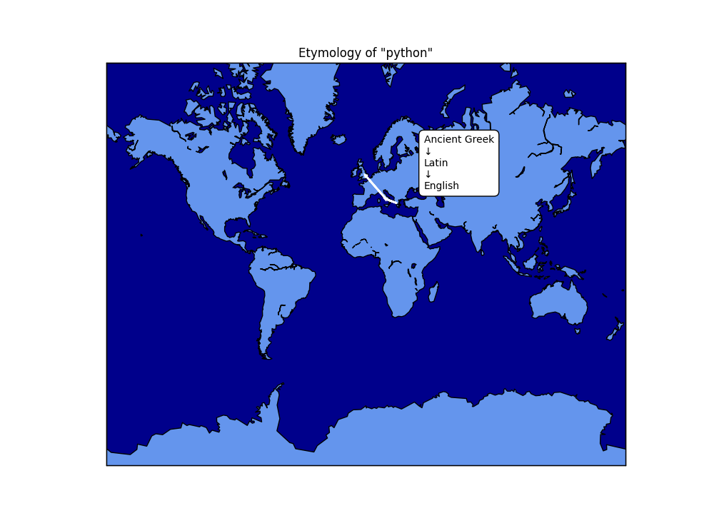

# etymaps

*"The poets made all the words, and therefore language is the archives of history, and, if we must say it, a sort of tomb of the muses. For, though the origin of most of our words is forgotten, each word was at first a stroke of genius, and obtained currency, because for the moment it symbolized the world to the first speaker and to the hearer. The etymologist finds the deadest word to have been once a brilliant picture. Language is fossil poetry."*

—Ralph Waldo Emerson

## What is it?

Etymaps is a python program that scrapes [Wiktionary](https://www.wiktionary.org/) for etymology data and then plots the path words took to get into their modern form on a map.



It looks like this.

It doesn't work on every word; if the etymology is unclear, or has multiple paths, or has an oddly-worded Wiktionary page, there may be some errors in parsing it. 

## Usage

### Installation

With python installed, run:

``` pip install -r requirements.txt ```

Then:

``` python etymaps.py ```

### Word search

In order to create an etymology map, enter a word into the "word" tab and hit "go." Etymaps is designed for words with clear, single-path, well-attested etymologies. For compound words, please search for each part of the compound individually. Some words with unclear etymologies (or oddly-worded Wiktionary entries) may not be mappable.

The search function is case sensitive. Proper nouns ought to be capitalized. Words ought to be input using their original writing systems; that is, if you are searching a Korean word, it ought to be in Hangul, and if it's a Russian word, please use Cyrillic. When using Japanese, please use kanji rather than katakana or hiragana wherever possible.

You can also trace the etymology of suffixes, like the "ish" in "English," by prepending a hyphen. (For example, search "-ish".) Prefixes, given names, surnames, and names of cities usually also work, if there is a clear enough etymology.

If the program successfully parsed a mappable etymology, a "map" button will appear at the bottom of the window. Click it to create a map.

### Specifying a language

Many Wiktionary pages only have one language on them, but sometimes a single word happens to exist with the same spelling in multiple languages. By default, Etymaps will select the first language on the page. 

Wiktionary organizes them alphabetically. For example, if you search зима, Etymaps will automatically give you the etymology for it in Bulgarian, because it starts with a B. Say you'd actually like to know the etymology of зима in Russian or Ukrainian or Old Church Slavonic. You can specify a language to prioritize by going into the 'Settings' tab and selecting the 'Specify a language' box.

When you return to the etymology tab, there should be an entry box for the language as well. Enter your target language and search as usual, and if the language exists on the page for that word and in the Etymaps dataset, it should be mappable.

### Miscellaneous other settings

You can also tell the app whether to draw the borders of countries on its maps, and what resolution to plot the coastlines and borders in. Low resolution is recommended; higher resolutions may take a while to plot and make the maps lag.

Since the maps are from a matplotlib package, you can zoom in and move them around using the toolbar at the top of each image.

## The dataset

Roughly 2,600 sets of languages and coordinates are from [the World Atlas of Language Structures dataset.](https://github.com/cldf-datasets/wals) This dataset is licensed under a Creative Commons 4.0 International license. It has been modified slightly for the purposes of this project; namely, the formatting of certain language names have been changed to bring them in line with Wiktionary's naming and formatting conventions. (For example, something like Frisian (West) in the WALS database would be listed as West Frisian in Wiktionary.)

### WALS citation

> Dryer, Matthew S. & Haspelmath, Martin (eds.) 2013. The World Atlas of Language Structures Online. Leipzig: Max Planck Institute for Evolutionary Anthropology. (Available online at [https://wals.info/](https://wals.info/))

> [https://doi.org/10.5281/zenodo.13950591](https://doi.org/10.5281/zenodo.13950591)

Coordinates for everything else—at the time of editing this README, around 400 mostly extinct and reconstructed languages—were chosen specifically for this project. For ancient and reconstructed languages, attempts were made to choose coordinates according to the most popular theory regarding their locations.

### CSV files in this repo

There are two.

* language_coords.csv is the main dataset.
* diff.csv is the set of languages on Wiktionary but not in the current dataset, as generated using a file from [here.](https://en.wiktionary.org/wiki/Wiktionary:List_of_languages,_csv_format) It's mainly used to distinguish between language families and languages that aren't in the dataset yet.

## Disclaimer

The etymologies in this program are only as accurate as the ones in Wiktionary. While Wiktionary is generally pretty good, it is a publicly editable resource, so please double-check with a trusted source (such as the Oxford English Dictionary) as necessary.

The coordinates for extinct and reconstructed languages were chosen by hand, according to popular hypotheses as of December 2024, and so may be subject to error.


## Acknowledgements

This project would not be possible without the contributions of the authors of the World Atlas of Language Structures, as well as the creators of Wiktionary and all of its many contributors. Their efforts are truly appreciated.
